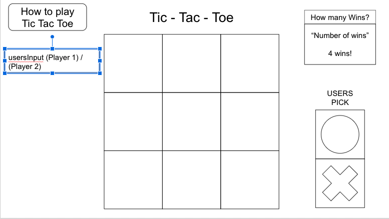

# Tic - Tac - Toe

## Description

A browser board game that allows users to utilize a "O" or a "X" to mark there play. This game is first one to get three inputs in a row; wins.

What I used to develop this game:
Javascript,
HTML,
& CSS

What have I learned throughout this game?

What are the struggles that I encountered when I was making this game?

What was I most happy about when creating this game?

----- IGNORE FOR DEVELOPER ONLY -----

## Planning

- 3x3 board game
- Player 1 - Player 2 - Computer
- invoke a eventListener ('click') to allow userInput to mark there play.
- reset button to allow the browser board game to clear.

### User Stories

#### MVP

- As a user, I want a browser-based interface so that I can play the game.
- As a user, I want the game to reach a win and state who won and can play again.
- As a user, I want to place my token so that I can interact with the game.
- As a user, I want to identify player one and player two.
- As a user, I want the ability to reset the game-board and clear out all the inputs.
- As a user, I want to be able to see the score-board of how many times player 1 have won, and how many times player 2 have won.
- As a user, I want the game to recognize a tie so it can reset the game.
- As a user, I want to have an indication/textbox that allows me to see who's turn it is.
- AS a user, I Want the game to indicate an answer whether I Won, lost or tie.

#### Bronze

- As a user, I want player that goes first to be randomly determined.
- As a user I want a visual representation of who's turn it is.
- As a user I want a visual representation of who won the game.
- As a user, I want a scoreboard to track my win-count.

#### Silver

- As a user, I want to be able to play the game with a friend.
- As a user, I want the game to store my stats even if I leave the page.
- As a user, I want there to be a rankings leaderboard.
- As a user, I want there to be different difficulty levels from the AI.
- As a user, I want a prompt box to pop up explaining how to play the game.

#### Gold

- As a user, I want to be able to upload my own image as my token so that I can customize my game.
- As a user, I want to be able to upload my own image as my token so that I can customize the game.
- As a user, I want cosmetic options for different styles of board.
- As a user, I want to be able to play different forms of the game, such as 3-dimensional Tic-Tac-Toe
- As a user, I want the game to have a global match-making system so that I can play against other users that are similarly-ranked

### WireFrame

<!-- ![About Tic Tac Toe] -->